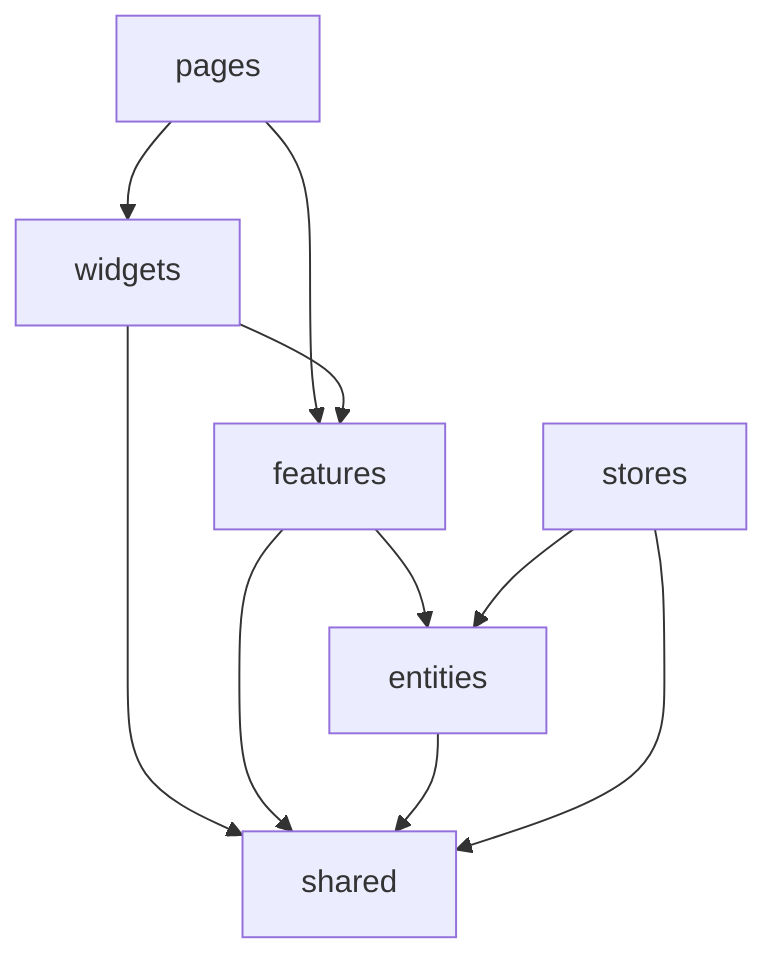

# 前端架构优化方案

更新时间：2026-07-08

## 1. 文档目的

本文档基于对当前代码库（约 3.4 万行 `src/`）的审查，总结项目结构性问题，并给出**成熟、健壮、可持续发展**的目标架构与分阶段落地路线。

适用范围：全项目（不仅 `home` 模块），重点覆盖模块边界、组件拆分、数据层、样式体系与工程化约束。

---

## 2. 现状画像

### 2.1 代码体量分布

| 区域 | 行数（约） | 问题特征 |
|------|-----------|----------|
| `home/dashboard/DetailedDashboardWorkspace.vue` | 3183 | 巨型单文件 |
| `home/dashboard/DayPreviewPanel.vue` | 3110 | 巨型单文件 + 1800 行 CSS |
| `home/dashboard/CalendarWorkspace.vue` | 2584 | 巨型单文件 |
| `leader-board/index.vue` | 1889 | 页面 = 业务 + 图表 + 样式 |
| `home/dashboard/CalendarMonth.vue` | 1534 | 日历双视图合一 |
| `agent-center/index.vue` | 1357 | 同上 |
| `auth/LoginPage.vue` | 1198 | 动效 + 大量 scoped CSS |
| `home/dashboard/todo.service.ts` | 1087 | 认证 + 映射 + CRUD + AI 全能文件 |
| `suggestion-inbox/SuggestionInboxPage.vue` | 921 | 新模块已在重复老模式 |

全项目 **scoped CSS 约 14,238 行**，占源码约 **41%**。样式膨胀是全局问题，不是 `home` 独有。

### 2.2 已有做得好的地方

- 按 `modules/` 划分业务（auth / home / agent-center / leader-board / suggestion-inbox）
- 有 `shared/request` HTTP 层、`stores/` 全局状态
- 有 shadcn/reka 基础组件 `components/ui/`
- 有 `styles/` 全局 token（`variables.css`、`theme.css`）
- vitest 测试覆盖较好（尤其 `todo.service`、`todoDisplay`）
- 有 `docs/frontend-code-index.md` 文件索引

底子不差，主要缺**边界约束**和**持续拆分机制**，导致功能不断堆进少数大文件。

---

## 3. 核心问题诊断

### 3.1 巨型单文件组件（P0）

多个 Vue 文件同时承担：数据加载、筛选、详情缓存、CRUD、弹层状态、键盘快捷键、大量 CSS。

**建议上限：**

- 单文件 **< 500 行**（理想）
- 超过 **800 行**必须拆分

### 3.2 模块边界被打破（P0）

当前存在跨模块「偷 import」：

```
auth/LoginPage.vue              → home/dashboard/todo.service.ts
agent-center/index.vue          → home/dashboard/DashboardTopBar.vue
stores/dashboard-todos.store    → home/dashboard/todo.service.ts
suggestion-inbox                → home/dashboard/suggestion.service.ts
```

**后果：** `home` 成为事实上的核心单体；改顶栏可能影响智能体中心；auth 无法独立演进。

### 3.3 重复业务逻辑（P0）

`CalendarWorkspace.vue` 与 `DetailedDashboardWorkspace.vue` 约 **40%–50%** 逻辑重复：

- accept / reject / delete / toggle 待办
- `openTodoFromNotification`
- `taskDetails` 详情缓存
- `DayPreviewPanel` 双 ref（view + edit）
- 快捷创建 + AI 解析流程

待办筛选逻辑有 **三套实现**：

- `dayPreviewPanel.helpers.ts`
- `CalendarWorkspace.vue`
- `DetailedDashboardWorkspace.vue`

日历有 **两套实现**：

- 总览模式：内联周条 + 月历
- 详细模式：`CalendarMonth.vue` + 自建 `buildMonth/WeekCalendarDays`

### 3.4 样式体系混乱（P1）

| 体系 | 位置 | 实际使用 |
|------|------|----------|
| shadcn/reka + Tailwind token | `components/ui/`、`variables.css` | 基础组件 |
| 自定义 scoped CSS | 各页面 `.vue` | **主力**，约 1.4 万行 |
| DaisyUI | `tailwind.config.cjs` | **零引用** |

问题：

- `--app-primary` 与 `--todo-primary` 等 token 重复定义
- 玻璃拟态在 composable 与各组件 CSS 中各写一套
- 技术栈选了 Tailwind + shadcn，页面却在写传统巨型 scoped CSS

### 3.5 数据层无领域边界（P1）

`todo.service.ts` 同时承担：

- 认证（login / logout / getInfo）
- 后端 DTO 归一化（30+ private 函数）
- CRUD + 状态流转
- AI 解析
- 日期范围工具

auth、store、home 都直接依赖它，SmartTodo 后端被焊死在 `home` 模块内。

### 3.6 其他问题

| 问题 | 说明 |
|------|------|
| `composables/` 缺失 | `components.json` 已配置 alias，但目录不存在 |
| 死代码 | `CalendarWeekTimeline.vue`（378 行，零引用） |
| 硬编码 | 2026 节假日/节气写在 `CalendarWorkspace.vue` 内 |
| ECharts 重复 | `agent-center` 与 `leader-board` 各写 init/resize 逻辑 |
| Toast 不统一 | Calendar 用 `showToast` 包装，Detailed 直接 `feedbackStore` |

---

## 4. 目标架构

采用 **「轻量 Feature-Sliced + 模块路由」** 混合结构，兼顾 Vue 生态习惯与长期可维护性。

### 4.1 目标目录结构

```
src/
├── app/                          # 应用启动层（保持）
│   ├── main.ts
│   ├── App.vue
│   └── providers/
│
├── pages/                        # 路由薄页面（只做组装，<200行）
│   ├── dashboard/
│   ├── agent-center/
│   ├── leader-board/
│   └── ...
│
├── widgets/                      # 跨页面组合块
│   ├── app-shell/
│   │   ├── AppTopBar.vue         # 原 DashboardTopBar，去 home 化
│   │   └── AppLayout.vue
│   ├── notification-center/
│   └── onboarding-tour/
│
├── features/                     # 可复用业务能力（无路由）
│   ├── todo/
│   │   ├── api/
│   │   ├── model/
│   │   ├── composables/
│   │   └── ui/
│   ├── calendar/
│   ├── sys-message/
│   ├── token-usage/
│   └── suggestion/
│
├── entities/                     # 领域实体（纯数据 + 规则，无 UI）
│   ├── user/
│   ├── todo/
│   └── message/
│
├── shared/                       # 全局基础设施
│   ├── api/                      # 原 shared/request/
│   ├── ui/                       # 原 components/ui/（或保留 alias）
│   ├── composables/
│   ├── lib/
│   ├── constants/
│   ├── types/
│   └── utils/
│
├── styles/                       # 样式体系（见第 5 节）
│   ├── index.css
│   ├── foundation/
│   ├── patterns/
│   └── modules/                  # 可选：按 feature 拆业务样式
│
├── assets/
├── stores/                       # 仅放真正全局的 store
└── router/
```

`modules/` 可**逐步退役**：保留 `routes.ts` 作过渡，页面迁到 `pages/`，能力迁到 `features/`。

### 4.2 依赖规则（必须写进文档 + ESLint）



**硬规则：**

1. `features` 之间不能互相 import（通过 `entities` 或 `shared` 共享）
2. `pages` 不能 import 其他 `pages`
3. **`auth` 不能依赖 `home` / `todo` 的任何文件**
4. `widgets` 是跨页面 UI，不属于某个业务模块
5. 单文件超过 **500 行**必须拆分（建议 CI 检查）

---

## 5. 样式体系方案

### 5.1 结论

**CSS 要抽离，但不是抽成一个 `css/` 大杂烩**，而是三层分工：

| 层级 | 目录 | 内容 | 原则 |
|------|------|------|------|
| L1 基础 | `styles/foundation/` | reset、variables、theme、transitions | 全局 token，已有可延续 |
| L2 模式 | `styles/patterns/` 或 Tailwind `@layer components` | 玻璃面板、表单模块、筛选条、空状态块 | **复用 ≥ 2 次**才提升 |
| L3 组件 | `.vue` scoped | 仅该组件独有的布局微调 | 控制在 50–100 行 |

### 5.2 建议新增的 patterns

```
styles/patterns/
  glass-surface.css      # dashboard-glass-surface + useDashboardGlassSettings
  panel-card.css         # 各页面重复的 card/panel 壳
  filter-bar.css         # 待办筛选条（三处重复）
  form-module.css        # DayPreviewPanel 表单区
  page-shell.css         # 页面容器、背景图
```

示例（Tailwind layer）：

```css
/* styles/patterns/glass-surface.css */
@layer components {
  .glass-surface {
    @apply backdrop-blur-xl border border-white/80;
    background: var(--app-panel-bg);
    box-shadow: var(--app-shadow-soft);
  }
}
```

### 5.3 Token 统一

在 `variables.css` 收敛分散 token：

```css
:root {
  --app-primary: #4f7cff;

  /* 消灭组件内重复定义 */
  --todo-primary: var(--app-primary);
  --todo-surface: var(--app-panel-bg);
  --glass-blur: 18px;
  --glass-saturation: 1.4;
}
```

`useDashboardGlassSettings` 只读这些变量，不再内联 style 对象。

### 5.4 不建议的做法

- 把所有 scoped CSS 搬到独立文件夹（失去组件封装）
- 继续堆 scoped CSS 不用 Tailwind（与现有技术选型背离）
- 保留 DaisyUI（当前零引用，建议移除）

### 5.5 新代码样式约定

- **Tailwind**：布局、间距、响应式
- **patterns 语义类**：玻璃面板、卡片壳、筛选条
- **scoped**：仅组件私有微调

旧代码：**不动除非触达**（渐进迁移）。

---

## 6. 各模块改造思路

### 6.1 home → pages + features + widgets

```
pages/dashboard/DashboardPage.vue          # <200行，只组装
features/todo/                               # service、composables、表单组件
features/calendar/                           # CalendarMonth、节假日数据
widgets/app-shell/AppTopBar.vue              # 从 home 抽出
widgets/notification-center/                   # 通知中心
```

两个 workspace 共用 composable：

- `useTodoTaskActions` — accept / reject / delete / toggle
- `useTodoDetailCache` — taskDetails、loadDetail
- `useTodoFilters` — 统一筛选 + 计数
- `useDayPreviewHost` — 面板开关、dirty 表单、双 ref

`DayPreviewPanel` 拆分建议：

```
features/todo/ui/day-preview/
  DayPreviewPanel.vue          # 薄壳
  DayPreviewList.vue           # 列表 + 筛选
  DayPreviewForm.vue           # 创建/编辑/查看
  DayPreviewFormSchedule.vue   # 时间/全天/截止模式
```

### 6.2 auth → 独立认证域

```
entities/user/api/auth.api.ts     # login、logout、getInfo（从 todo.service 拆出）
features/auth/ui/LoginPage.vue
```

`LoginPage` 只调 `auth.api`，不再依赖 `todo.service`。

### 6.3 agent-center / leader-board → 页面变薄

```
pages/agent-center/AgentCenterPage.vue
features/agent-catalog/                  # mock、links、目录 UI
shared/composables/useECharts.ts         # 统一 init / resize / dispose
features/token-usage/                    # 已有，继续用
```

### 6.4 suggestion-inbox → 独立 feature

```
features/suggestion/
  api/suggestion.api.ts
  ui/SuggestionInboxPage.vue
  ui/SuggestionBox.vue
```

新模块不要继续 import `home/dashboard/suggestion.service`。

### 6.5 stores 归位

| Store | 处置 |
|-------|------|
| `user.store` | 保留，全局 |
| `feedback.store` | 保留，全局 |
| `dashboard-todos.store` | 迁到 `features/todo/store` 或 `entities/todo` |

Store 不应 import `modules/home/...`，应依赖 `entities/todo`。

---

## 7. 数据层拆分方案

将 `todo.service.ts` 拆为：

```
entities/todo/
  api/
    client.ts              # requestSmartTodoData 底层
    auth.api.ts            # login / logout / getInfo / selectEmail
    todo.api.ts            # CRUD
    todo-ai.api.ts         # analyze
  model/
    types.ts               # 领域类型
    backend.types.ts       # 后端 DTO
    normalize.ts           # normalizeBackendTodo 等
    date-range.ts          # getTodoMonthRange / WeekRange
  lib/
    status.ts              # 状态映射、权限判断
  index.ts                 # 统一导出（兼容旧 import）
```

对外保留 `index.ts` 统一导出，旧路径可做 alias 过渡。

---

## 8. 共享能力抽取

### 8.1 Composables（新建 `shared/composables/`）

| Composable | 用途 |
|------------|------|
| `useECharts.ts` | ECharts init / resize / dispose |
| `useTodoTaskActions.ts` | 待办 CRUD 动作 |
| `useTodoDetailCache.ts` | 详情缓存 |
| `useTodoFilters.ts` | 筛选逻辑 |
| `useDayPreviewHost.ts` | 单日面板宿主逻辑 |

### 8.2 日历统一

```
features/calendar/
  CalendarMonth.vue            # 唯一日历实现
  HomeWeekStrip.vue            # 从 CalendarWorkspace 抽出周条
  calendar-days.builder.ts     # buildMonth / WeekDays 纯函数
  calendar-special-days/
    2026.ts                    # 节假日数据（从组件内抽出）
```

总览模式也改用 `CalendarMonth` + `HomeWeekStrip`，消灭双实现。

### 8.3 死代码与硬编码清理

- 删除 `CalendarWeekTimeline.vue`（零引用）
- 移除 DaisyUI 依赖与配置
- 去掉 `CalendarWorkspace` 内重复的 `ymd()`（改用 `todoDisplay.ymd`）
- 统一 toast → 全部走 `feedbackStore`

---

## 9. 测试策略

测试跟**领域**走，不跟 `.vue` 文件走：

```
features/todo/
  api/todo.api.test.ts
  model/normalize.test.ts
  composables/useTodoFilters.test.ts
```

`todoDisplay` 的多个 test 文件可逐步合并到 `model/` 旁。

---

## 10. 工程化约束（建议）

| 工具 / 规则 | 作用 |
|-------------|------|
| `eslint-plugin-boundaries` 或 `import/no-restricted-paths` | 强制模块依赖规则 |
| CI 文件行数检查 | 单文件 >500 warn，>800 fail |
| 移除 `daisyui` | 减依赖、减配置噪音 |
| `ARCHITECTURE.md` | 维护依赖规则与目录约定（本文档） |

---

## 11. 分阶段落地路线

### Phase 1（约 1 周）：立规矩 + 快速减负

- [ ] 删除 `CalendarWeekTimeline.vue`
- [ ] 移除 DaisyUI 依赖与配置
- [ ] 统一 token 到 `variables.css`
- [ ] 新增 `styles/patterns/glass-surface.css`
- [ ] 新建 `shared/composables/useECharts.ts`
- [ ] 节假日数据抽到 `calendar-special-days/2026.ts`
- [ ] 统一 toast 走 `feedbackStore`

### Phase 2（约 2 周）：解耦边界

- [ ] `todo.service` 拆出 `auth.api.ts`，auth 改 import
- [ ] `DashboardTopBar` → `widgets/app-shell/AppTopBar.vue`
- [ ] `suggestion` 独立到 `features/suggestion/`
- [ ] 抽取 `useTodoTaskActions`、`useTodoDetailCache`
- [ ] 抽取 `useTodoFilters`，三处筛选合一

### Phase 3（约 3–4 周）：拆上帝组件

- [ ] 拆分 `DayPreviewPanel`（最大 ROI）
- [ ] 统一日历到 `features/calendar/`
- [ ] `CalendarWorkspace` / `DetailedDashboardWorkspace` 瘦身至 <800 行
- [ ] `leader-board`、`agent-center` 页面瘦身

### Phase 4（持续）：样式体系迁移

- [ ] 每次改组件时，将可复用 CSS 提升到 `patterns/`
- [ ] 新代码遵循：Tailwind 布局 + patterns 语义类 + 少量 scoped
- [ ] 完整拆分 `todo.service` 到 `entities/todo/`
- [ ] `modules/` 逐步退役，迁到 `pages/` + `features/`

---

## 12. 优先级总览

| 优先级 | 动作 | 预期收益 |
|--------|------|----------|
| P0 | 抽 `useTodoTaskActions` + `useTodoDetailCache` | 减少约 800 行重复 |
| P0 | 统一筛选到 `useTodoFilters` | 三处筛选合一 |
| P0 | auth 从 `todo.service` 解耦 | 打破 home 单体 |
| P0 | `AppTopBar` 抽到 `widgets/` | 消除跨模块依赖 |
| P1 | 拆分 `DayPreviewPanel` | 最大单文件 3100 → ~400 |
| P1 | 日历统一用 `CalendarMonth` | 消灭双日历实现 |
| P1 | CSS patterns + token 统一 | 改主题只改一处 |
| P2 | 拆分 `todo.service.ts` | 接口变更更好维护 |
| P2 | `leader-board` / `agent-center` 瘦身 | 全项目可维护性提升 |
| P3 | 目录重组（`modules/` → `pages/` + `features/`） | 降低新人上手成本 |

---

## 13. 目标指标

| 维度 | 现状 | 目标 |
|------|------|------|
| 最大单文件 | 3183 行 | < 500 行 |
| workspace 重复率 | ~45% | < 10% |
| 筛选实现 | 3 套 | 1 套 |
| 日历实现 | 2 套 | 1 套 |
| scoped CSS 总量 | ~14,238 行 | 逐步降至 < 8000 行 |
| 死代码 | 378+ 行 | 0 |
| `todo.service` | 1087 行全能 | 按职责 5–6 文件 |
| 跨模块违规 import | 多处 | 0（ESLint 拦截） |

---

## 14. 一句话总结

问题不在「文件多」，而在**缺分层约束、公共能力焊在 home、样式没有体系**。方向是：

1. **pages 变薄，features 承载业务，widgets 放跨页 UI**
2. **样式三层：foundation / patterns / scoped**
3. **entities 承载领域，打破 home 单体**
4. **工程化护栏 + 渐进迁移，不推倒重来**

建议第一步：**Phase 1 + auth 解耦 + AppTopBar 抽到 widgets**。改动面可控，能立刻让项目从「home 单体」变成「有骨架的应用」。

---

## 15. 相关文档

- [前端代码文件索引](./frontend-code-index.md) — 当前文件职责速查
- `.cursor/rules/frontend-code-index.mdc` — Cursor 规则中的架构速查
